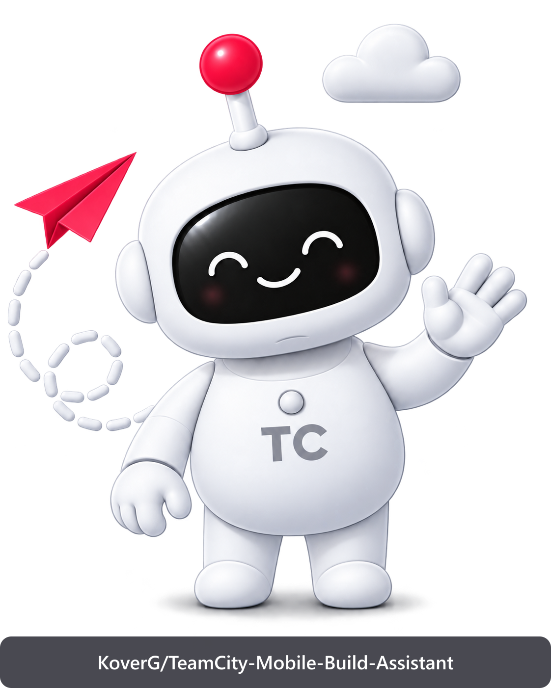
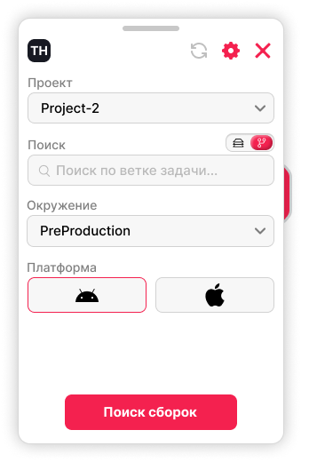
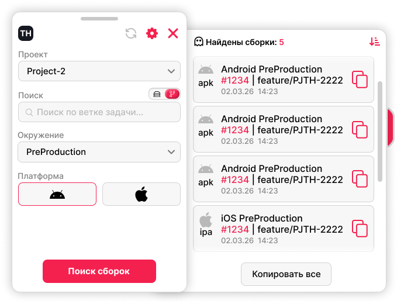
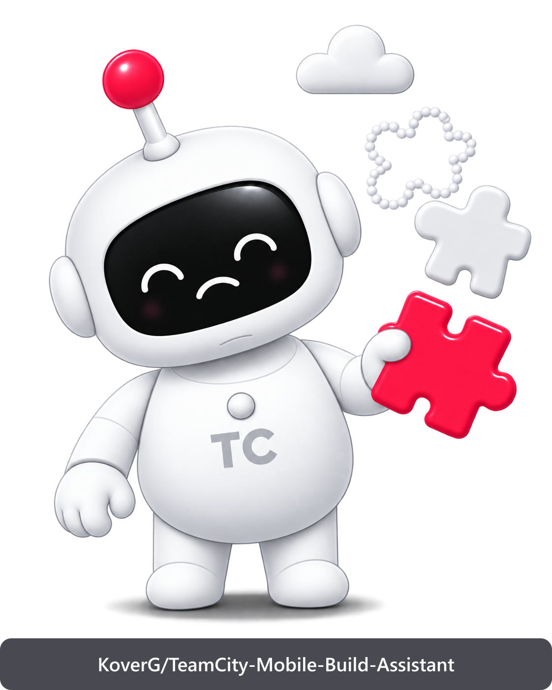
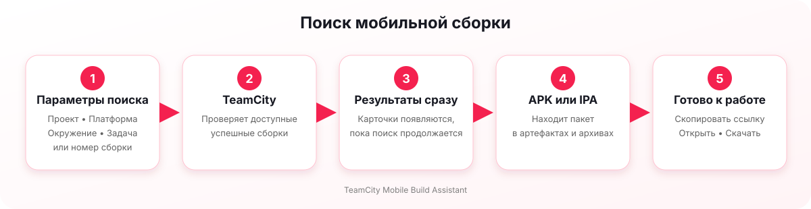
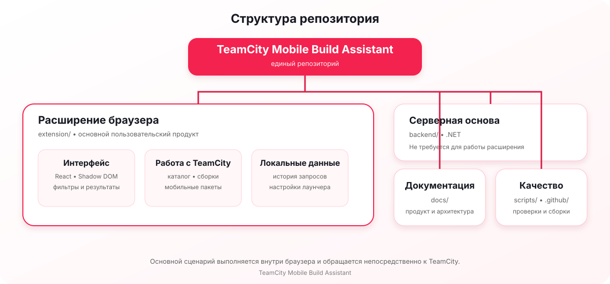

<div align="center">



# TeamCity Mobile Build Assistant

**Быстрый поиск APK и IPA в успешных сборках TeamCity — прямо на странице проекта.**

**Формат поставки:** GitHub Release ZIP · **Лицензия:** MIT · **Платформа:** Chromium Manifest V3

[Скачать готовую сборку](https://github.com/KoverG/TeamCity-Mobile-Build-Assistant/releases/latest) · [Собрать самостоятельно](#самостоятельная-сборка) · [Возможности](#что-умеет-расширение)

</div>

TeamCity Mobile Build Assistant — расширение для браузера, которое помогает быстро найти нужную мобильную сборку, получить прямую ссылку на APK или IPA и перейти к работе с файлом без ручного просмотра множества страниц TeamCity.

Расширение работает в текущей авторизованной вкладке TeamCity. Для основного сценария не требуется отдельный сервер, а данные для входа и файлы cookie не считываются и не сохраняются.

<p align="center">
  
  
</p>

## Практическая ценность

Поиск мобильного пакета в TeamCity часто требует открыть проект, выбрать конфигурацию, найти подходящую ветку и проверить содержимое нескольких сборок или архивов. Ассистент объединяет эти действия в одном окне и сокращает время между запросом нужной версии и получением файла для тестирования или установки.

Типовой сценарий состоит из четырёх шагов:

1. Выбрать проект, платформу и окружение.
2. Указать часть названия задачи или точный номер сборки.
3. Сразу просматривать найденные результаты, пока поиск продолжается.
4. Скопировать ссылку, открыть сборку или скачать мобильный пакет.

## Что умеет расширение

- находит успешные сборки Android и iOS по задаче или номеру;
- фильтрует результаты по проекту, платформе и окружению;
- показывает найденные сборки сразу, не заставляя ждать завершения всего поиска;
- находит APK и IPA, даже если они находятся внутри вложенных архивов;
- позволяет остановить поиск, сохранив уже найденные результаты;
- сортирует результаты и позволяет выбрать нужные сборки;
- копирует одну ссылку или сразу несколько ссылок;
- открывает страницу сборки и найденный мобильный пакет;
- запоминает последние поисковые запросы отдельно для задач и номеров сборок;
- показывает понятные состояния загрузки, отсутствия результатов, частичной ошибки и остановленного поиска.

Полный список функций и состояние их проверки приведены в [матрице функций](docs/FEATURE_MATRIX.md).

## Состояния ассистента

<table>
  <tr>
    <td align="center" width="33%">
      <br>
      <strong>Готов к поиску</strong>
    </td>
    <td align="center" width="33%">
      <br>
      <strong>Идёт поиск</strong>
    </td>
    <td align="center" width="33%">
      <br>
      <strong>Ничего не найдено</strong>
    </td>
  </tr>
</table>

Для README используются отдельные копии маскотов с водяным знаком репозитория. Оригинальные изображения интерфейса не изменяются.

## Установка

Есть два способа установки: скачать готовый архив из GitHub Releases или самостоятельно собрать расширение из исходного кода.

### Готовая сборка из GitHub Releases

Для публичных версий будет публиковаться готовый ZIP-архив, внутри которого уже находится собранное расширение. Компиляция и установка Node.js в этом случае не нужны.

1. Откройте раздел [GitHub Releases](https://github.com/KoverG/TeamCity-Mobile-Build-Assistant/releases/latest).
2. Скачайте файл `teamcity-mobile-build-assistant-<версия>.zip` из блока **Assets**.
3. Распакуйте архив в отдельную постоянную папку. Не удаляйте её после установки.
4. Откройте страницу управления расширениями:
   - Chrome: `chrome://extensions`;
   - Edge: `edge://extensions`;
   - Яндекс Браузер: `browser://tune`.
5. Включите режим разработчика.
6. Нажмите «Загрузить распакованное расширение» и выберите распакованную папку, в которой находится файл `manifest.json`.
7. Откройте HTTPS-страницу TeamCity и нажмите иконку расширения на панели браузера.
8. Подтвердите доступ к текущему адресу TeamCity.

> Браузер не устанавливает ZIP-файл напрямую: архив нужно сначала распаковать. Ссылка на готовый файл начнёт работать после публикации первого GitHub Release.

### Самостоятельная сборка

Этот способ подходит разработчикам и тем, кто хочет собрать текущую версию непосредственно из репозитория.

Требования:

- Node.js 22 или новее;
- npm;
- Chromium-совместимый браузер.

1. Скачайте исходный код через кнопку **Code → Download ZIP** и распакуйте его либо клонируйте репозиторий:

   ```powershell
   git clone https://github.com/KoverG/TeamCity-Mobile-Build-Assistant.git
   cd TeamCity-Mobile-Build-Assistant
   ```

2. Установите зависимости расширения:

   ```powershell
   npm.cmd --prefix extension ci
   ```

3. Соберите обычную пользовательскую версию:

   ```powershell
   npm.cmd --prefix extension run build:production
   ```

4. Откройте страницу управления расширениями, включите режим разработчика и загрузите каталог `extension/dist-production` как распакованное расширение.

Команда `npm ci` устанавливает точные версии библиотек из lock-файла. Команда `build:production` проверяет TypeScript и создаёт готовые файлы расширения без диагностической консоли.

### Диагностическая сборка

Диагностическая версия предназначена только для локального поиска проблем. Она содержит временную техническую консоль и не должна использоваться как обычная пользовательская сборка.

```powershell
npm.cmd --prefix extension run build:diagnostic
```

Результат появится в каталоге `extension/dist`. Устанавливается он так же, как обычная распакованная версия. Диагностические адреса, ответы TeamCity и журналы нельзя переносить в исходный код, документацию, задачи GitHub или историю Git.

## Разрешения и приватность

После нажатия иконки расширения браузер может запросить разрешение на работу с открытым адресом TeamCity. Эти системные разрешения нужны, чтобы встроить панель ассистента в текущую страницу, выполнить поиск от имени уже авторизованного пользователя и сохранить несколько локальных настроек. Расширение не получает постоянный автоматический доступ ко всем сайтам без действия пользователя.

| Разрешение браузера | Когда используется | Что позволяет сделать |
|---|---|---|
| Доступ к активной вкладке | После нажатия иконки расширения | Определить адрес открытой страницы TeamCity. |
| Выполнение сценария на странице | После подтверждения доступа к текущему адресу | Добавить панель ассистента на страницу TeamCity. |
| Локальное хранилище браузера | Во время работы с интерфейсом | Сохранить историю запросов и положение кнопки ассистента. |
| Доступ к текущему HTTPS-адресу | При первом запуске на конкретном сервере TeamCity | Выполнять запросы поиска только к разрешённому адресу. |

Основной сценарий выполняет только запросы на чтение. Расширение не считывает файлы cookie напрямую, не сохраняет логины, пароли, токены и полные ответы TeamCity. Пользовательские ссылки и результаты поиска не отправляются на отдельный сервер приложения.

Подробнее: [политика безопасности](SECURITY.md) и [правила интеграции с TeamCity](docs/TEAMCITY_INTEGRATION.md).

## Как выполняется поиск

<div align="center">
  
</div>

Найденные карточки появляются по мере обработки сборок. Пока поиск продолжается, вместо общей кнопки копирования отображается индикатор загрузки. Уже найденные карточки остаются доступными. Если следующая часть поиска завершилась ошибкой, результаты не пропадают — ассистент показывает предупреждение и позволяет повторить попытку.

## Совместимость и известные ограничения

- Расширение предназначено для браузеров на основе Chromium с поддержкой Manifest V3.
- В план ручной проверки входят Google Chrome, Microsoft Edge и Яндекс Браузер. Итоговая проверка всех пользовательских сценариев ещё должна быть выполнена перед релизом.
- Поддерживаются только защищённые адреса TeamCity, начинающиеся с `https://`.
- Платформа и окружение определяются по названиям конфигураций сборки. Неизвестные варианты показываются в отдельной группе и остаются доступными для поиска.
- Если в одной сборке найдено несколько подходящих APK или IPA, расширение не выбирает файл автоматически и просит уточнить результат.
- Возможность открыть или скачать файл зависит от прав текущего пользователя и срока хранения артефактов на сервере TeamCity.
- Интерфейс рассчитан прежде всего на настольный браузер. Полная проверка экранными дикторами и формальная проверка контрастности ещё не проводились.

## Решение проблем

### Кнопка ассистента не появилась

1. Убедитесь, что открыта HTTPS-страница TeamCity.
2. Повторно нажмите иконку расширения и подтвердите доступ к текущему адресу.
3. После обновления распакованного расширения перезагрузите его на странице управления и обновите вкладку TeamCity.

### Каталог или поиск не загружается

1. Убедитесь, что вход в TeamCity выполнен в этой же вкладке.
2. Обновите каталог кнопкой в панели ассистента.
3. Проверьте, что текущему пользователю доступны нужные проекты, сборки и артефакты.
4. Если проблема сохраняется, установите диагностическую сборку по инструкции выше и изучите локальную техническую консоль.

## Разработка

### Технологии

- TypeScript 6, React 19 и Vite 8;
- Chrome Extension Manifest V3;
- Vitest и Testing Library;
- независимая серверная основа на .NET 10;
- GitHub Actions для автоматических проверок и сборки.

### Структура проекта

<div align="center">
  
</div>

Серверная часть является заготовкой для будущих возможностей и не требуется для поиска сборок в TeamCity.

### Проверка изменений

Эти команды нужны разработчикам перед отправкой изменений на проверку. Они последовательно проверяют типы, стиль кода, автоматические тесты, обе сборки, серверную основу и отсутствие закрытых данных в публичных файлах.

| Команда | Что проверяет |
|---|---|
| `npm.cmd --prefix extension run typecheck` | Корректность типов TypeScript во всех частях расширения и тестах. |
| `npm.cmd --prefix extension run lint` | Единый стиль кода и типовые ошибки JavaScript/TypeScript. |
| `npm.cmd --prefix extension run test:run` | Все автоматические тесты расширения. |
| `npm.cmd --prefix extension run build` | Диагностическую сборку с технической консолью. |
| `npm.cmd --prefix extension run build:production` | Пользовательскую сборку без диагностических возможностей. |
| `dotnet test TeamCityHelper.sln --configuration Release` | Сборку и тесты серверной основы. |
| `powershell -NoProfile -ExecutionPolicy Bypass -File scripts/public-safety-scan.ps1` | Отсутствие секретов и реальных данных TeamCity в публичных файлах. |

Полный набор можно выполнить из корня репозитория:

```powershell
npm.cmd --prefix extension run typecheck
npm.cmd --prefix extension run lint
npm.cmd --prefix extension run test:run
npm.cmd --prefix extension run build
npm.cmd --prefix extension run build:production
dotnet test TeamCityHelper.sln --configuration Release
powershell -NoProfile -ExecutionPolicy Bypass -File scripts/public-safety-scan.ps1
```

## Документация

- [Матрица функций и подтверждённого поведения](docs/FEATURE_MATRIX.md)
- [Описание продукта](docs/PRODUCT.md)
- [Архитектура и границы безопасности](docs/ARCHITECTURE.md)
- [Интеграция с TeamCity](docs/TEAMCITY_INTEGRATION.md)
- [План поставки](docs/MVP_DELIVERY.md)
- [Участие в разработке](CONTRIBUTING.md)
- [Политика безопасности](SECURITY.md)

## Лицензия

[MIT](LICENSE) © 2026 KoverG
