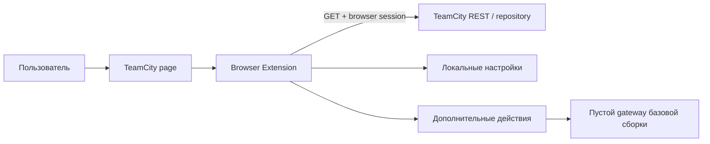

# TeamCity Mobile Build Assistant — архитектура и безопасность

- Статус: согласованная архитектурная база
- Дата фиксации: 2026-08-08
- Последнее обновление: 2026-08-22 (версия 1.2.0)

Связанные документы:

- [PRODUCT.md](PRODUCT.md) — продуктовые правила;
- [TEAMCITY_INTEGRATION.md](TEAMCITY_INTEGRATION.md) — TeamCity-контракты и результаты исследования;
- [MVP_DELIVERY.md](MVP_DELIVERY.md) — порядок реализации и проверки.

## 1. Архитектурное решение

Базовое расширение является автономным TeamCity-клиентом:

```text
TeamCity page
  ↕ существующая browser-session пользователя
Browser Extension
  ├── TeamCity REST API
  ├── локальные storage и diagnostics
  └── AdditionalActionsService
         └── NullAdditionalActionsGateway
```

Поиск, выбор, копирование, скачивание и открытие builds и artifacts работают без собственного backend. Расширение использует только текущую TeamCity-сессию пользователя и не читает cookie напрямую.

Для будущих Telegram-функций существует единый frontend-контур дополнительных действий. Базовая сборка подключает пустой gateway: он не выполняет сетевых запросов и не создаёт элементы интерфейса. В дальнейшем отдельный Telegram API-adapter сможет заменить gateway без изменения UI-слотов и TeamCity-модулей. Универсальность технического контура нужна для централизованного внедрения Telegram-функций в разных местах расширения и не расширяет серверный scope на другие интеграции.

### 1.1. Public-safe by design

Repository изначально считается публичным. Любой tracked-файл, commit, branch, tag, pull request, CI artifact и текст ошибки рассматривается как потенциально доступный всему интернету.

Запрещено помещать в repository и историю Git:

- реальные TeamCity origins, внутренние домены, IP-адреса и VPS hostnames;
- реальные названия/ID компаний, проектов, build configurations, builds, branches и artifact paths;
- usernames, emails и другие персональные данные;
- passwords, tokens, pairing codes, cookies, session values, authorization headers, private keys и webhook secrets;
- raw TeamCity responses, network captures, screenshots и logs реальной системы;
- production database, backups, `.env`, локальные browser profiles и IDE-конфигурации с секретами.

Для tests и документации используются только синтетические значения и зарезервированные домены `example.test` или `example.invalid`.

## 2. Контекст системы



Собственный backend не входит в runtime-контур базовой версии. Каталог `backend` содержит только независимый foundation и health endpoints; расширение не зависит от его доступности.

## 3. Технологический стек

### Browser Extension

- Manifest V3;
- TypeScript и React;
- Vite;
- Shadow DOM;
- Chrome Extension APIs;
- Chromium: Chrome, Edge, Яндекс Браузер.

### Backend foundation

- C# и .NET 10 LTS;
- ASP.NET Core;
- health checks и безопасное logging foundation;
- без прикладных API дополнительных действий в версии 1.2.0.

## 4. Browser Extension

### 4.1. Модули

```text
extension/src/
├── additional-actions/
│   └── AdditionalActionsService.ts     # единая загрузка, валидация и выполнение
├── content/
│   ├── App.tsx                         # composition root
│   ├── additional-actions/
│   │   ├── AdditionalActionsProvider.tsx
│   │   ├── AdditionalActionSlot.tsx
│   │   └── useAdditionalActionsAt.ts
│   ├── TeamCityNavTab.*
│   └── assistant/
│       ├── useAssistantController.ts
│       ├── AssistantWorkspace.tsx
│       ├── AssistantPanel.tsx
│       ├── PanelToolbar.tsx
│       └── BuildResults.tsx
├── teamcity/
│   ├── TeamCityTransport.ts
│   ├── CatalogLoader.ts
│   ├── BuildConfigurationClassifier.ts
│   ├── BuildFinder.ts
│   ├── BuildArtifactSearch.ts
│   └── ArtifactResolver.ts
├── storage/
├── diagnostics/
└── background/
```

Зависимости направлены внутрь:

```text
UI → controller/services → TeamCity adapters
UI slots → AdditionalActionsService → injected gateway
```

TeamCity-модули не зависят от дополнительных действий. Gateway не получает прямой доступ к TeamCity transport, browser-session или Chrome API.

### 4.2. UI и layout

React UI монтируется в Shadow DOM и использует изолированные стили. Основная панель и drawer результатов имеют собственные layout-контракты.

Дополнительные действия подключаются через placement-идентификаторы:

- `assistant-toolbar` — компактные кнопки в раскрываемой области настроек;
- `build-results` — действия над текущим выбором найденных builds.

UI-слот получает готовые descriptors от общего provider. Он не загружает конфигурацию самостоятельно и не знает адрес API. Размер toolbar и число колонок footer вычисляются по фактически показанным действиям; пустой gateway не оставляет отступов, разделителей или disabled-кнопок.

### 4.3. TeamCity origin и transport

Origin определяется из активной TeamCity-вкладки и нормализуется как `scheme + host + optional port`, без path, query, fragment и credentials.

Extension запрашивает `optional_host_permission` только после явного действия пользователя. TeamCity GET выполняется через service worker, а при несовместимости browser-session используется ограниченный same-origin fallback в MAIN world.

Оба транспорта:

- принимают только HTTPS origin текущей вкладки;
- разрешают только нормализованные TeamCity REST paths;
- имеют timeout и лимит размера ответа;
- не читают и не пересылают cookie вручную;
- возвращают стабильные application errors вместо raw исключений.

### 4.4. Локальное состояние

В `chrome.storage.local` могут храниться:

- история поисковых запросов;
- положение, сторона viewport и compact-состояние launcher;
- несекретные UI-настройки.

TeamCity cookies, authorization headers и integration credentials там не хранятся. Фильтры, черновики, результаты и выбранные карточки существуют только в памяти открытой рабочей UI-сессии. При запуске удаляется устаревшая запись выбора предыдущих версий; между рабочими UI-сессиями остаётся только история из пяти запросов для каждого режима. Tenant-specific данные изолированы нормализованным TeamCity origin.

## 5. Универсальный контур Telegram-действий

### 5.1. Единая точка входа

`AdditionalActionsService` является единственной границей между UI и будущим серверным слоем Telegram-функций. Он:

- загружает descriptors один раз через подключённый gateway;
- проверяет identifier, placement, context, label, tooltip и icon ID;
- ограничивает общее число действий и число действий в одном placement;
- отклоняет весь список при неизвестном или повреждённом descriptor;
- выполняет только ранее загруженное действие;
- создаёт request ID и блокирует несовместимый context;
- преобразует ошибку gateway в безопасный результат.

UI получает descriptors через один React provider. Добавление нового места отображения требует нового placement и UI-слота, но не нового API-клиента.

### 5.2. Контексты

Разрешены только заранее определённые context-типы:

- `none` — действие не получает данные TeamCity;
- `build-selection` — ограниченный список выбранных builds.

`build-selection` содержит только внутреннюю ссылочную модель: build ID/number, имя и относительный `contentHref` artifact, platform. Этот объект формируется централизованно и не содержит cookie, token, request headers или raw TeamCity response.

Конкретный Telegram API-контракт в версии 1.2.0 не фиксируется. Будущий adapter обязан преобразовать внутреннюю модель в согласованный DTO и повторно валидировать все данные на границе сети.

### 5.3. Иконки и текст

Descriptor может выбрать только локальный `iconId` из короткого allowlist. SVG-код, HTML, CSS, JavaScript, URL, команды и имена обработчиков не являются допустимыми полями.

Label и tooltip имеют ограниченную длину и выводятся React как текст. Неизвестная иконка, placement или context блокирует весь полученный набор.

### 5.4. Gateway базовой сборки

`NullAdditionalActionsGateway` возвращает пустой список и результат `unavailable`. Он не использует `fetch`, Chrome messaging, storage или backend configuration.

UI одинаково обрабатывает результаты любого gateway: показывает завершение, ошибку или недоступность действия. Для контекста `build-selection` кнопка недоступна до явного выбора хотя бы одной сборки; невыбранные результаты в запрос не попадают.

Это гарантирует:

- полную работоспособность базовых TeamCity-сценариев без сервера;
- отсутствие скрытых сетевых запросов;
- отсутствие пустых мест в UI;
- возможность тестировать слоты через synthetic gateway;
- замену gateway в одном composition root при появлении API.

## 6. Безопасность

### 6.1. Extension messaging

Service worker принимает только известные типы сообщений и валидирует sender, identifiers, origin и paths. Content script не может передать произвольный URL для privileged fetch или открытия вкладки.

### 6.2. TeamCity data

- реальные runtime URL и response bodies не пишутся в production logs;
- diagnostic build хранит данные только в памяти вкладки;
- TeamCity credentials и cookies не передаются собственному backend;
- для tests используются синтетические contracts;
- artifact search сохраняет bounded limits, concurrency и timeout.

### 6.3. Будущий сетевой gateway

До подключения сетевого gateway должны быть отдельно согласованы:

- фиксированный HTTPS backend origin;
- схема и версия ответа;
- проверка источника, срока действия и целостности;
- cache и fail-closed поведение;
- авторизация и idempotency;
- минимальный execution DTO;
- privacy disclosure и пользовательское подтверждение.

Удалённый ответ остаётся декларативными данными и никогда не становится исполняемым кодом.

## 7. Backend foundation

Текущий backend — независимый ASP.NET Core foundation:

- корневой status endpoint;
- liveness и readiness health checks;
- UTC structured console logging;
- отсутствие прикладных интеграционных endpoints.

Его запуск, deployment и доступность не требуются для использования расширения версии 1.2.0.

## 8. Проверки

Для source-изменений выполняются:

```powershell
npm.cmd --prefix extension run typecheck
npm.cmd --prefix extension run lint
npm.cmd --prefix extension run test:run
npm.cmd --prefix extension run build
npm.cmd --prefix extension run build:production
dotnet test TeamCityHelper.sln --configuration Release
powershell -NoProfile -ExecutionPolicy Bypass -File scripts/public-safety-scan.ps1
```

Дополнительно проверяются production/diagnostic distributive, keyboard navigation, отсутствие пустых UI-слотов и работа базовых сценариев с пустым gateway.

## 9. Принятые решения

| Решение | Статус |
|---|---|
| Базовые TeamCity-функции не зависят от собственного backend | Принято |
| Один `AdditionalActionsService` для всех UI placements | Принято |
| Пустой gateway и отсутствие сети в базовой сборке | Принято |
| Только локальный allowlist иконок | Принято |
| Конкретный API-контракт откладывается до разработки backend | Принято |
| Внешняя логика не добавляется в TeamCity-модули и UI-слоты | Принято |
| Реальные TeamCity данные запрещены в repository и Git history | Принято |
