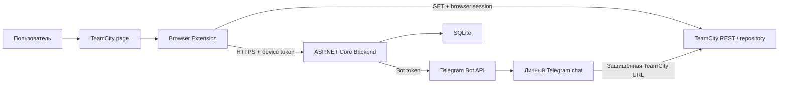
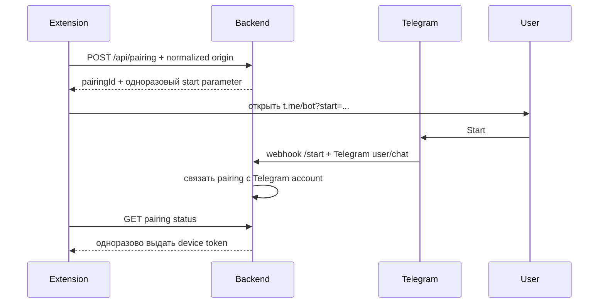

# TeamCity Mobile Build Assistant — архитектура и безопасность

- Статус: согласованная архитектурная база
- Дата фиксации: 2026-08-08
- Последнее обновление: 2026-08-11

Связанные документы:

- [PRODUCT.md](PRODUCT.md) — продуктовые правила;
- [TEAMCITY_INTEGRATION.md](TEAMCITY_INTEGRATION.md) — TeamCity-контракты и результаты исследования;
- [MVP_DELIVERY.md](MVP_DELIVERY.md) — порядок реализации и проверки.

## 1. Архитектурное решение

Выбрана гибридная архитектура:

```text
TeamCity page
  ↕ пользовательская browser-session
Browser Extension
  ├── TeamCity REST API
  └── Backend API
         ├── Telegram pairing
         ├── Entitlements
         ├── Idempotency / rate limiting
         └── Telegram Bot API
```

TeamCity-запросы выполняются из Browser Extension с использованием уже существующей пользовательской сессии. Backend не хранит TeamCity credentials, не получает TeamCity cookies и не скачивает artifacts.

Backend централизует Telegram Bot Token, pairing, будущие подписки и защиту endpoint отправки.

### 1.1. Непереговорное требование: public-safe by design

Repository изначально считается публичным, даже пока он существует только локально. Любой tracked-файл, commit, branch, tag, pull request, CI artifact и текст ошибки рассматривается как потенциально доступный всему интернету.

Запрещено помещать в repository и историю Git:

- реальные TeamCity origins, внутренние домены, IP-адреса и VPS hostnames;
- реальные названия/ID компаний, проектов, build configurations, builds, branches и artifact paths;
- usernames, emails, Telegram user/chat IDs и другие персональные данные;
- passwords, tokens, pairing codes, cookies, session values, authorization headers, private keys и webhook secrets;
- raw TeamCity responses, network captures, screenshots и logs, полученные при исследовании реальной системы;
- production database, backups, `.env`, Rider run configurations с секретами и локальные browser profiles.

Это требование действует одинаково для source code, comments, tests, fixtures, snapshots, documentation, examples, commit messages и CI logs. Удаление секрета следующим commit не устраняет утечку из истории Git.

Разрешены только:

- синтетические значения, явно обозначенные как примеры;
- placeholders вида `<teamcity-origin>` и `<build-type-id>`;
- зарезервированные example-домены;
- ссылки на публичную документацию поставщиков.

Если для диагностики нужны реальные ответы TeamCity, они сохраняются только во временном локальном каталоге, который находится вне Git или жёстко исключён `.gitignore`. До создания fixture данные преобразуются в минимальный синтетический контракт; raw response в repository не копируется.

## 2. Контекст системы



## 3. Технологический стек

### Browser Extension

- Manifest V3;
- TypeScript;
- React;
- Vite;
- Shadow DOM;
- Chrome Extension APIs;
- Chromium: Chrome, Edge, Яндекс Браузер.

### Backend

- C#;
- .NET 10 LTS;
- ASP.NET Core;
- Entity Framework Core;
- SQLite для MVP;
- встроенные `HttpClient`, configuration, logging, rate limiting и health checks.

### Разработка

- основная IDE: JetBrains Rider;
- Extension в MVP устанавливается как unpacked extension в режиме разработчика;
- commit/push являются отдельными явно согласуемыми действиями.

## 4. Browser Extension

### 4.1. Модули

```text
extension/
├── content-script/
│   ├── TeamCityPageHost
│   ├── ShadowDomRoot
│   └── TeamCityPageIntegration
├── ui/
│   ├── selectors
│   ├── build-list
│   ├── artifact-state
│   ├── onboarding
│   └── telegram-pairing
├── teamcity/
│   ├── TeamCityContext
│   ├── TeamCityTransport
│   ├── SessionProbe
│   ├── CatalogLoader
│   ├── BuildConfigurationClassifier
│   ├── BuildFinder
│   └── ArtifactResolver
├── backend/
│   └── TelegramGatewayClient
├── browser/
│   ├── BrowserStorage
│   ├── BrowserPermissions
│   ├── BrowserTabs
│   └── BrowserRuntime
└── storage/
    └── ExtensionSettings
```

### 4.2. Встраивание UI

Content script создаёт Shadow Root и перемещаемый launcher-хлястик, визуально закреплённый у правой границы левой навигации TeamCity. React UI монтируется внутрь Shadow DOM, чтобы стили TeamCity и Extension не влияли друг на друга.

Хлястик не встраивает React root внутрь TeamCity-компонента: semantic navigation element используется только как измеряемый anchor. Его фактическая геометрия отслеживается через browser observers, поэтому позиционирование не зависит от фиксированной ширины sidebar, разрешения или browser zoom. Pointer capture применяется только к выделенному вертикальному хвату: основные кнопки не участвуют в drag-жесте, а в compact-состоянии сам хват остаётся доступен для перемещения и разворачивания. При смене compact-состояния корпус раскрывается внутри общего clipping-контейнера, а хват постоянно привязан к его движущейся границе; геометрия рассчитывается сразу по конечному размеру состояния, поэтому элементы не догоняют друг друга между кадрами. Горизонтальное открепление включается только после прохождения порога, равного ширине раскрытого launcher; до порога жест меняет лишь вертикальное положение. При отпускании выбирается ближайшая сторона относительно середины контентного viewport, после чего launcher пружинно закрепляется у левой навигации или перед вертикальной полосой прокрутки справа и зеркально меняет направление корпуса и панели. Ширина контентного viewport берётся из `document.documentElement.clientWidth`, а её изменения отслеживаются вместе с геометрией navigation element. При SPA-пересоздании navigation element launcher повторно привязывается к новому anchor. Основная панель остаётся изолированным overlay и не зависит от `overflow` или stacking context TeamCity.

Визуальные слои разделены по ответственности:

- `tokens.css` содержит только общие design tokens и базовые правила Shadow DOM;
- `TeamCityNavTabVisual.tsx` содержит только SVG-визуал launcher;
- `TeamCityNavTabGeometry.ts` является единым источником размеров launcher для визуала и drag-геометрии;
- `TeamCityNavTab.css` содержит только геометрию, состояния и анимацию launcher, а также размещение panel stack относительно него;
- `AssistantPanel.css` содержит только визуал основной функциональной панели и её controls;
- `DiagnosticConsole.css` содержит только визуал диагностической панели.

Размеры launcher передаются из `TeamCityNavTabGeometry.ts` в CSS custom properties, поэтому drag-геометрия и визуальный размер не дублируются. Граница между stylesheets защищена regression-тестом: селекторы launcher и основной панели не могут смешиваться или переопределять друг друга.

DOM-интеграция TeamCity изолируется в `TeamCityPageIntegration`. В MVP она отвечает только за общий launcher. Во второй итерации в неё добавляется обнаружение строк builds и монтирование локальных кнопок.

DOM selectors считаются нестабильной интеграционной границей и покрываются отдельными тестами/feature flag.

### 4.3. TeamCity origin

Origin определяется автоматически из активной TeamCity-вкладки:

```text
window.location.origin
```

Он не хардкодится в бизнес-логике. При этом origin проходит проверку доверия:

- Extension запрашивает `optional_host_permission` только для текущего origin после явного действия пользователя;
- origin нормализуется как `scheme + host + optional port`, без path, query, fragment и credentials;
- при pairing installation привязывается к обнаруженному origin либо его устойчивому server-side идентификатору;
- backend принимает build link только для origin, привязанного к аутентифицированному device/account;
- production code и поставляемая конфигурация не содержат allowlist конкретной компании.

Новая TeamCity-инсталляция подключается через тот же flow без изменения и пересборки исходного кода. Manifest не получает постоянный доступ ко всем сайтам, если это не будет отдельно обосновано и согласовано.

### 4.4. TeamCity transport — обязательный spike

Конкретный транспортный вариант должен быть выбран первым техническим прототипом:

- запрос из extension service worker с `host_permissions`;
- либо запрос из контекста страницы/content integration, если этого требует фактическая cookie/SSO-конфигурация.

Критерий выбора: REST GET использует существующую TeamCity-сессию, не читая и не пересылая cookie вручную.

Extension не запрашивает `chrome.cookies` без доказанной необходимости и никогда не передаёт TeamCity cookie backend.

### 4.5. Локальное состояние

В `chrome.storage.local` хранятся:

- `installationId`;
- `rememberSelection`;
- выбранные Project/OS/Environment;
- нормализованное вертикальное положение, сторона viewport и compact-состояние launcher для текущего TeamCity origin;
- `onboardingAcceptedVersion`;
- device token, полученный после Telegram pairing;
- несекретные UI-настройки.

TeamCity cookie и Telegram Bot Token там отсутствуют.

Project/OS/Environment хранятся отдельно для каждого нормализованного runtime TeamCity origin и только после явного включения checkbox запоминания. Переключение на другой origin не переносит tenant-specific selection между инсталляциями.

## 5. Backend

### 5.1. Тип архитектуры

Backend — простой модульный монолит. Микросервисы, message broker и Kubernetes для MVP не нужны.

```text
backend/
├── Api
├── Pairing
├── Devices
├── Telegram
│   ├── BotWebhook
│   ├── TelegramSender
│   └── MessageFormatter
├── Access
│   ├── DeviceAuthentication
│   ├── Entitlements
│   ├── Idempotency
│   └── RateLimiting
├── TeamCityLinks
│   ├── TrustedOriginStore
│   └── TeamCityLinkValidator
├── Persistence
└── Observability
```

Telegram API details не должны распространяться за пределы модуля `Telegram`.

### 5.2. Основные команды

Минимальный API:

```text
POST /api/pairing
GET  /api/pairing/{id}/status
POST /api/build-links/send
POST /api/telegram/webhook
GET  /health/live
GET  /health/ready
```

Точные DTO фиксируются при реализации OpenAPI contract.

`POST /api/pairing` принимает нормализованный origin текущей TeamCity-вкладки и создаёт запрос на привязку этого origin к installation. В Telegram-подтверждении пользователь видит hostname, который он связывает с Extension.

`POST /api/build-links/send` не принимает произвольный `chat_id` и произвольный message text. Он принимает структурированные build metadata, ID доверенного TeamCity instance и artifact path/URL, после чего backend сам формирует сообщение.

## 6. Telegram pairing и device authentication

### 6.1. Pairing flow



Pairing code:

- криптографически случайный;
- короткоживущий;
- одноразовый;
- в БД хранится в виде hash.

Device token:

- случайный bearer token достаточной энтропии;
- в БД хранится только hash;
- может быть отозван;
- привязан к `installationId` и Telegram account;
- разрешает отправку только для TeamCity origins, явно связанных с этим device;
- передаётся только по HTTPS.

Один Telegram account имеет несколько активных devices.

### 6.2. Idempotency

Каждая отправка получает уникальный `Idempotency-Key`, создаваемый Extension. Backend хранит результат команды и не отправляет повторное Telegram-сообщение при повторной доставке того же запроса.

Idempotency защищает от:

- двойного клика;
- retry после timeout;
- повторной доставки из нескольких вкладок;
- нестабильной сети.

## 7. Entitlements

Перед Telegram-отправкой всегда выполняется единая политика:

```text
AuthenticateDevice
→ ResolveTelegramAccount
→ CheckEntitlement(SendTelegramBuildLink)
→ ValidateTeamCityLink
→ ApplyRateLimit
→ CheckIdempotency
→ SendTelegramMessage
```

UI может скрывать недоступную кнопку, но окончательное решение всегда принимает backend.

MVP выдаёт всем paired accounts `Active`. Будущая платная подписка меняет реализацию `EntitlementService`, а не use case отправки.

## 8. Данные

Минимальная модель SQLite:

```text
TelegramAccounts
- Id
- TelegramUserId (unique)
- TelegramChatId
- Status
- CreatedAt

ExtensionDevices
- Id
- TelegramAccountId
- InstallationId
- DeviceTokenHash
- CreatedAt
- LastSeenAt
- RevokedAt

TeamCityInstances
- Id
- NormalizedOriginEncrypted
- OriginLookupHash
- CreatedAt

DeviceTeamCityInstances
- ExtensionDeviceId
- TeamCityInstanceId
- ConfirmedAt
- RevokedAt

PairingRequests
- Id
- CodeHash
- InstallationId
- TeamCityInstanceId
- ExpiresAt
- CompletedAt
- TelegramAccountId

Entitlements
- TelegramAccountId
- Capability
- Status
- ExpiresAt

IdempotencyRecords
- TelegramAccountId
- Key
- RequestHash
- Result
- ExpiresAt
```

DB не хранит:

- TeamCity credentials/cookies;
- APK/IPA;
- Telegram Bot Token;
- полную историю Telegram messages;
- Project/OS/Environment preferences.

Normalized origin является чувствительной runtime-конфигурацией. Он шифруется at rest ключом, который хранится вне repository; для поиска и сравнения используется keyed hash. Таблицы production SQLite, backups и encryption keys никогда не входят в Git или distributable image.

## 9. Безопасность

Безопасность публичного repository определяется разделом [1.1](#11-непереговорное-требование-public-safe-by-design). Любое исключение требует отдельного архитектурного решения; локальное удобство отладки не является основанием для исключения.

### 9.1. Secrets

Backend secrets:

- Telegram Bot Token;
- webhook secret;
- production Data Protection/signing keys при необходимости.

В production secrets передаются через существующий secret mechanism VPS: Docker secrets, защищённый environment file с минимальными правами или внешний secret manager. Они не включаются в repository, image или frontend bundle.

В repository допускаются только шаблоны наподобие `.env.example` с заведомо нерабочими placeholders. Все реальные значения внедряются при запуске. Конфигурация должна завершать startup понятной ошибкой при отсутствии обязательного секрета и никогда не печатать его значение.

### 9.2. Repository и supply-chain controls

До первого commit обязательны:

- `.gitignore` для `.env*` с явным исключением безопасного `.env.example`, локальных БД/backups, logs, captures, screenshots, browser profiles, Rider settings, `bin`, `obj`, `node_modules`, build output и временных исследовательских fixtures;
- автоматический secret scan до commit и в CI;
- проверка repository на запрещённые tenant-specific маркеры и private URL patterns;
- dependency lock files и автоматизированная проверка уязвимых зависимостей;
- минимальные permissions для CI tokens и отсутствие secrets в workflows для pull requests из недоверенных forks.

Перед каждым commit проверяются staged paths и staged diff. Перед первой публикацией проверяется вся история Git, а не только текущее дерево. При обнаружении утечки публикация останавливается, credential немедленно отзывается/ротируется, после чего история очищается отдельной согласованной процедурой.

### 9.3. Link validation

Backend не доверяет URL от Extension. Проверяются:

- схема только `https`;
- origin совпадает с origin, привязанным к аутентифицированному device/account;
- отсутствие username/password во входном URL;
- разрешённый TeamCity `repository/download` path;
- допустимые `buildTypeId`, `buildId` и artifact path;
- расширение файла `.apk` или `.ipa`;
- отсутствие path traversal и неоднозначной URL-нормализации.

Предпочтительно передавать структурированные части ссылки и собирать итоговый URL на backend.

### 9.4. Telegram endpoint

Защита включает:

- device bearer token;
- entitlement;
- idempotency;
- rate limit по account/device/IP;
- device-bound TeamCity origin;
- ограничение размеров полей;
- запрет произвольного `chat_id`;
- запрет произвольного текста/URL;
- журналирование результата без tokens и cookies.

### 9.5. CORS и HTTPS

- Backend доступен только по HTTPS.
- CORS разрешает только ожидаемые Extension origins/режимы запросов.
- `Access-Control-Allow-Origin: *` вместе с credentialed запросами запрещён.
- TeamCity host permissions запрашиваются минимально необходимым scope.
- Telegram webhook проверяет server-side secret.

### 9.6. Безопасная диагностика реальной TeamCity

- Debug logging в production-сборке не содержит request/response bodies и полных URLs. В явно включённой локальной diagnostic-сборке UI может временно показать эти данные для проверки REST-контракта.
- Реализация diagnostic-консоли изолирована в `extension/src/diagnostics`: store, React UI, CSS, transport observer, service decorator и UI observer. Product UI не вызывает diagnostic logger напрямую; подключение выполняется только в content-script composition root через optional observer и React slot.
- TeamCity origin, project/build IDs, branch и artifact path считаются чувствительными tenant data.
- Для correlation используются внутренние opaque IDs или необратимые keyed hashes; raw значения не журналируются.
- Ошибки в UI и backend содержат стабильный error code и безопасное описание, но не raw HTML/XML/JSON.
- Network capture и JSON-копия diagnostic-журнала допускаются только локально для текущего исследования, не прикрепляются к issues и не переносятся в repository. Diagnostic-журнал не содержит cookies и request headers и исчезает вместе с вкладкой, если пользователь явно не открыл временную JSON-копию.
- Любой fixture создаётся синтетически по форме контракта и проходит автоматическую проверку на private hostnames, identifiers, tokens и персональные данные.

## 10. Развёртывание

Backend размещается на существующем VPS, но изолируется от основного проекта:

- отдельный Docker Compose project;
- отдельный container;
- отдельный network;
- отдельный volume SQLite;
- отдельные secrets/environment;
- отдельный hostname и reverse-proxy route;
- отдельные logs;
- resource limits;
- резервная копия SQLite volume.

Общим допускается только инфраструктурный reverse proxy и сам VPS host. Не используются БД, filesystem paths, environment или runtime основного приложения.

## 11. Наблюдаемость

Структурированные logs содержат:

- correlation ID;
- operation;
- обезличенный внутренний device/account ID;
- opaque instance ID или keyed hash origin;
- тип операции над build без raw build ID/buildType ID;
- результат pairing/entitlement/send;
- category ошибки;
- latency.

В logs запрещены:

- Telegram Bot Token;
- device token;
- pairing code;
- cookies;
- полный чувствительный webhook payload;
- пользовательские credentials;
- полные TeamCity URLs, origins, project/build IDs, branch names и artifact paths;
- raw request/response bodies внешних систем.

Минимальные метрики:

- количество pairing attempts/success/failures;
- send attempts/success/failures;
- entitlement denials;
- rate-limit denials;
- Telegram latency/errors;
- SQLite health.

## 12. Принятые архитектурные решения

| Решение | Статус |
|---|---|
| TeamCity API вызывается из Extension под browser-session | Принято |
| TeamCity credentials на backend отсутствуют | Принято |
| Личные сообщения Telegram через pairing | Принято |
| Несколько активных Extension devices | Принято |
| Idempotency вместо политики «последнее устройство» | Принято |
| SQLite в MVP | Принято |
| React + TypeScript + Vite + Shadow DOM | Принято |
| ASP.NET Core / .NET 10 | Принято |
| Modular monolith | Принято |
| Unpacked extension для MVP | Принято |
| Конкретный TeamCity transport | Определяется первым spike |
| Форма REST responses | Подтверждается первым spike без сохранения raw data в Git |
| Fixtures в repository | Только минимальные synthetic contracts |
| Public repository и public-safe-by-design | Обязательно с первого commit |
| Реальные tenant data в repository/history | Запрещены |
| TeamCity origin | Runtime discovery + explicit permission + device binding |
| Artifact listing | Bulk `GET /builds/{locator}/artifacts` основной; metadata/children traversal только fallback |
| Поддержка разных TeamCity-инсталляций без изменения кода | Обязательно |
